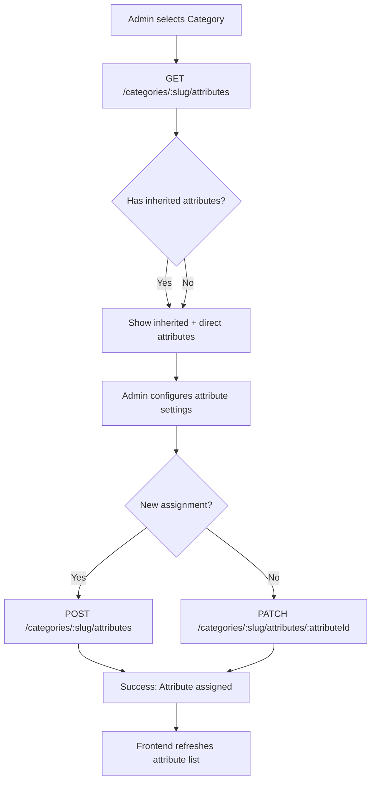

# Category Page Attribute Assignment — Full Implementation Guide

> **Audience:** Backend & Frontend developers implementing the admin panel for category attribute management.  
> **Scope:** Covers all APIs, data contracts, validation rules, business logic, and do's/don'ts for the category-attribute assignment feature.

---

## Table of Contents

1. [Overview](#overview)
2. [Database Schema](#database-schema)
3. [Core Concepts](#core-concepts)
4. [API Endpoints](#api-endpoints)
5. [Request & Response Formats](#request--response-formats)
6. [Validation Rules & Business Logic](#validation-rules--business-logic)
7. [Do's and Don'ts](#dos-and-donts)
8. [Implementation Flow](#implementation-flow)
9. [Error Handling](#error-handling)
10. [Frontend Integration Notes](#frontend-integration-notes)

---

## 1. Overview

This feature allows the admin panel to **assign attributes to categories** and configure how those attributes behave on the category page and product variant selection.

### Key Capabilities

- **Create / Read / Update / Delete** categories
- **Create / Read / Update / Delete** attributes (e.g., "Color", "Size")
- **Create / Read / Update / Delete** attribute values (e.g., "Red", "Blue", "Large")
- **Assign attributes to categories** with configuration:
  - `sortOrder` — display order on the category page
  - `isRequired` — whether the attribute is mandatory for products in this category
  - `isVariantSelectable` — whether the attribute can be used to select product variants
  - `valueRestrictionMode` — controls which attribute values are available:
    - `ALL` — all values of the attribute are available (default)
    - `SELECTED` — only specific `valueIds` are available
    - `NONE` — no values are available (attribute effectively disabled)
- **Inherited attributes** — child categories automatically inherit attributes from their parent categories

---

## 2. Database Schema

### Prisma Models

```prisma
model Category {
  id                     Int                      @id @default(autoincrement())
  name                   String
  slug                   String                   @unique
  parentId               Int?
  isActive               Boolean                  @default(true)
  isDeleted              Boolean                  @default(false)
  deletedAt              DateTime?
  createdAt              DateTime                 @default(now())
  updatedAt              DateTime                 @updatedAt
  parent                 Category?                @relation("CategoryHierarchy")
  children               Category[]               @relation("CategoryHierarchy")
  attributes             CategoryAttribute[]
  images                 Image[]
  products               Product[]
}

model Attribute {
  id                     Int                      @id @default(autoincrement())
  name                   String                   @unique
  isActive               Boolean                  @default(true)
  isDeleted              Boolean                  @default(false)
  deletedAt              DateTime?
  values                 AttributeValue[]
  categoryAttributes     CategoryAttribute[]
}

model AttributeValue {
  id                     Int                      @id @default(autoincrement())
  value                   String
  attributeId             Int
  isActive                Boolean                  @default(true)
  isDeleted               Boolean                  @default(false)
  deletedAt               DateTime?
  attribute               Attribute                @relation(fields: [attributeId], references: [id])
  variants                VariantAttribute[]
}

model CategoryAttribute {
  categoryId           Int
  attributeId          Int
  sortOrder            Int                      @default(0)
  isRequired           Boolean                  @default(false)
  isVariantSelectable  Boolean                  @default(true)
  valueRestrictionMode ValueRestrictionMode     @default(ALL)
  attribute            Attribute                @relation(fields: [attributeId], references: [id])
  category             Category                 @relation(fields: [categoryId], references: [id])
  selectedValues       CategoryAttributeValue[] @relation("CategoryAttributeSelectedValues")

  @@id([categoryId, attributeId])
}

model CategoryAttributeValue {
  categoryId        Int
  attributeId       Int
  valueId           Int
  Attribute         Attribute         @relation(fields: [attributeId], references: [id])
  categoryAttribute CategoryAttribute @relation("CategoryAttributeSelectedValues", fields: [categoryId, attributeId], references: [categoryId, attributeId])
  Category          Category          @relation(fields: [categoryId], references: [id])
  value             AttributeValue    @relation(fields: [valueId], references: [valueId])

  @@id([categoryId, attributeId, valueId])
}

enum ValueRestrictionMode {
  ALL
  SELECTED
  NONE
}
```

### Important Indexes

| Model | Index | Purpose |
|-------|-------|---------|
| `Category` | `parentId` | Fast parent lookups |
| `Category` | `isActive` | Filter active categories |
| `Category` | `isDeleted` | Filter non-deleted categories |
| `AttributeValue` | `attributeId` | Fast value lookups by attribute |
| `CategoryAttribute` | `categoryId` | Fast attribute lookups by category |
| `CategoryAttribute` | `attributeId` | Fast category lookups by attribute |
| `CategoryAttributeValue` | `[categoryId, attributeId]` | Fast selected value lookups |

---

## 3. Core Concepts

### 3.1 Category Hierarchy

Categories support a **parent-child relationship** (tree structure):

```
Electronics (parentId: null)
  └── Smartphones (parentId: 1)
        └── Accessories (parentId: 2)
```

- A category can have **one parent** (`parentId`)
- A category can have **multiple children**
- **Circular references are prevented** — a category cannot be its own ancestor

### 3.2 Attribute Inheritance

When fetching attributes for a category, the system **automatically includes inherited attributes** from all ancestor categories.

**Example:**
- "Electronics" has attribute "Brand"
- "Smartphones" (child of Electronics) will also show "Brand" in its attributes

The `getByCategorySlug` endpoint traverses the parent chain and collects all ancestor category IDs, then fetches attributes for all of them.

### 3.3 Value Restriction Modes

| Mode | Behavior | `valueIds` Required? |
|------|----------|---------------------|
| `ALL` | All values of the attribute are available | No |
| `SELECTED` | Only the specified `valueIds` are available | **Yes** |
| `NONE` | No values are available (attribute disabled) | No |

### 3.4 Soft Deletes

Both `Category` and `Attribute` / `AttributeValue` support **soft deletes**:

- `isDeleted: true` + `deletedAt: set` marks as deleted
- Soft-deleted records are **excluded from queries** by default
- Deleting a category with products or subcategories is **blocked**
- Deleting an attribute with existing category assignments is **allowed** (the `CategoryAttribute` link is removed)

---

## 4. API Endpoints

### Base URL

```
/api/categories
/api/attributes
/api/attribute-values
```

> **Note:** The `api` prefix depends on your NestJS configuration. Check `src/main.ts` for the actual prefix.

---

### 4.1 Category Endpoints

| Method | Endpoint | Auth | Description |
|--------|----------|------|-------------|
| `POST` | `/categories` | Admin | Create a new category |
| `PATCH` | `/categories/:id` | Admin | Update a category |
| `PATCH` | `/categories/:id/toggle-status` | Admin | Toggle category active/inactive |
| `GET` | `/categories` | Public | List all categories (paginated) |
| `GET` | `/categories/:id` | Public | Get a single category |
| `DELETE` | `/categories/:id` | Admin | Soft-delete a category |

---

### 4.2 Attribute Endpoints

| Method | Endpoint | Auth | Description |
|--------|----------|------|-------------|
| `POST` | `/attributes` | Admin | Create a new attribute |
| `GET` | `/attributes` | Public | List all attributes |
| `GET` | `/attributes/:id` | Public | Get a single attribute with values |
| `PATCH` | `/attributes/:id` | Admin | Update an attribute |
| `DELETE` | `/attributes/:id` | Admin | Soft-delete an attribute |

---

### 4.3 Attribute Value Endpoints

| Method | Endpoint | Auth | Description |
|--------|----------|------|-------------|
| `POST` | `/attribute-values` | Admin | Create a new attribute value |
| `GET` | `/attribute-values` | Public | List all attribute values |
| `GET` | `/attribute-values/attribute/:attributeId` | Public | Get values for a specific attribute |
| `GET` | `/attribute-values/:id` | Public | Get a single attribute value |
| `PATCH` | `/attribute-values/:id` | Admin | Update an attribute value |
| `DELETE` | `/attribute-values/:id` | Admin | Soft-delete an attribute value |

---

### 4.4 Category-Attribute Endpoints

| Method | Endpoint | Auth | Description |
|--------|----------|------|-------------|
| `GET` | `/categories/:slug/attributes` | Public | Get all attributes for a category (including inherited) |
| `POST` | `/categories/:slug/attributes` | Admin | Assign an attribute to a category |
| `PATCH` | `/categories/:slug/attributes/:attributeId` | Admin | Update category attribute settings |
| `DELETE` | `/categories/:slug/attributes/:attributeId` | Admin | Remove an attribute from a category |

> **Note:** The `:slug` parameter accepts both **slug strings** (e.g., `electronics`) and **numeric IDs** (e.g., `1`). The backend resolves both automatically.

---

## 5. Request & Response Formats

### 5.1 Create Category

**Endpoint:** `POST /categories`  
**Auth:** Admin (JWT Bearer token required)  
**Headers:**
```
Content-Type: application/json
Authorization: Bearer <admin-jwt-token>
```

**Request Body:**
```json
{
  "name": "Electronics",
  "slug": "electronics",
  "parentId": null,
  "isActive": true,
  "images": [
    {
      "url": "https://example.com/electronics.jpg",
      "altText": "Electronics category",
      "position": 0
    }
  ]
}
```

**Field Rules:**

| Field | Type | Required | Rules |
|-------|------|----------|-------|
| `name` | string | **Yes** | Max 100 characters |
| `slug` | string | **Yes** | Lowercase, hyphen-separated, only letters and numbers. Pattern: `^[a-z0-9]+(?:-[a-z0-9]+)*$` |
| `parentId` | number | No | Must reference an existing, non-deleted category |
| `isActive` | boolean | No | Default: `true` |
| `images` | array | No | Array of image objects |
| `images[].url` | string | Yes (if images provided) | Valid URL |
| `images[].altText` | string | No | Alt text for image |
| `images[].position` | number | No | Display order, defaults to array index |

**Response:**
```json
{
  "message": "Category created successfully",
  "status": "success",
  "data": {
    "id": 1,
    "name": "Electronics",
    "slug": "electronics",
    "parentId": null,
    "isActive": true,
    "isDeleted": false,
    "createdAt": "2026-01-27T06:00:00.000Z",
    "updatedAt": "2026-01-27T06:00:00.000Z",
    "parent": null,
    "children": [],
    "images": [
      {
        "id": 1,
        "url": "https://example.com/electronics.jpg",
        "altText": "Electronics category",
        "position": 0,
        "type": "CATEGORY"
      }
    ]
  }
}
```

---

### 5.2 Update Category

**Endpoint:** `PATCH /categories/:id`  
**Auth:** Admin

**Request Body:**
```json
{
  "name": "Electronics & Gadgets",
  "slug": "electronics-gadgets",
  "parentId": null,
  "isActive": true,
  "images": [
    {
      "url": "https://example.com/new-image.jpg",
      "altText": "Updated image",
      "position": 0
    }
  ]
}
```

**Field Rules:**

| Field | Type | Required | Rules |
|-------|------|----------|-------|
| `name` | string | No | Max 100 characters |
| `slug` | string | No | Must be unique among non-deleted categories |
| `parentId` | number | No | Cannot be self, cannot create circular reference |
| `isActive` | boolean | No | — |
| `images` | array | No | **Replaces all existing images** |

> **Important:** When `images` is provided, **all existing images are deleted and replaced** with the new array. This is an atomic operation within a transaction.

**Response:** Same structure as Create Category.

---

### 5.3 Toggle Category Status

**Endpoint:** `PATCH /categories/:id/toggle-status`  
**Auth:** Admin

**Request Body:** None

**Response:**
```json
{
  "message": "Category is now inactive",
  "status": "success",
  "data": {
    "id": 1,
    "name": "Electronics",
    "isActive": false,
    "updatedAt": "2026-01-27T06:30:00.000Z"
  }
}
```

**Rules:**
- Cannot toggle status if category has **active subcategories**
- Error: `"Cannot toggle status of category with subcategories. Please toggle subcategories first."`

---

### 5.4 List Categories

**Endpoint:** `GET /categories`  
**Auth:** Public

**Query Parameters:**
| Param | Type | Required | Default | Description |
|-------|------|----------|---------|-------------|
| `page` | number | No | `1` | Page number |
| `limit` | number | No | `20` | Items per page |

**Response:**
```json
{
  "message": "Categories found",
  "status": "success",
  "data": [
    {
      "id": 1,
      "name": "Electronics",
      "slug": "electronics",
      "isActive": true,
      "parentId": null,
      "createdAt": "2026-01-27T06:00:00.000Z",
      "updatedAt": "2026-01-27T06:00:00.000Z",
      "parent": null,
      "children": [],
      "images": [...],
      "_count": { "products": 5 }
    }
  ],
  "meta": {
    "total": 10,
    "page": 1,
    "limit": 20,
    "totalPages": 1
  }
}
```

---

### 5.5 Get Single Category

**Endpoint:** `GET /categories/:id`  
**Auth:** Public

**Response:** Same as Create Category response, plus:
```json
{
  "data": {
    ...
    "products": [
      {
        "id": 1,
        "name": "iPhone 15",
        "slug": "iphone-15",
        "isActive": true
      }
    ],
    "_count": { "products": 5 }
  }
}
```

---

### 5.6 Delete Category

**Endpoint:** `DELETE /categories/:id`  
**Auth:** Admin

**Request Body:** None

**Response:**
```json
{
  "message": "Category deleted successfully",
  "status": "success",
  "data": null
}
```

**Rules:**
- **Soft delete only** — `isDeleted` is set to `true`, `deletedAt` is set
- Cannot delete if category has **associated products** (non-deleted)
- Cannot delete if category has **subcategories** (non-deleted)
- Already deleted categories return: `"Category already deleted"`

---

### 5.7 Create Attribute

**Endpoint:** `POST /attributes`  
**Auth:** Admin

**Request Body:**
```json
{
  "name": "Color"
}
```

**Field Rules:**

| Field | Type | Required | Rules |
|-------|------|----------|-------|
| `name` | string | **Yes** | Must be unique among non-deleted attributes |

**Response:**
```json
{
  "message": "Attribute created successfully",
  "status": "success",
  "data": {
    "id": 1,
    "name": "Color",
    "isActive": true,
    "isDeleted": false
  }
}
```

**Special Behavior:**
- If a **soft-deleted** attribute with the same name exists, it is **restored** instead of creating a new one
- Response message: `"Attribute restored successfully"`

---

### 5.8 List Attributes

**Endpoint:** `GET /attributes`  
**Auth:** Public

**Response:**
```json
{
  "message": "Attributes retrieved successfully",
  "status": "success",
  "data": [
    { "id": 1, "name": "Color", "isActive": true, "isDeleted": false },
    { "id": 2, "name": "Size", "isActive": true, "isDeleted": false }
  ]
}
```

---

### 5.9 Get Single Attribute

**Endpoint:** `GET /attributes/:id`  
**Auth:** Public

**Response:**
```json
{
  "message": "Attribute retrieved successfully",
  "status": "success",
  "data": {
    "id": 1,
    "name": "Color",
    "isActive": true,
    "isDeleted": false,
    "values": [
      { "id": 1, "value": "Red", "attributeId": 1, "isActive": true, "isDeleted": false },
      { "id": 2, "value": "Blue", "attributeId": 1, "isActive": true, "isDeleted": false }
    ]
  }
}
```

---

### 5.10 Update Attribute

**Endpoint:** `PATCH /attributes/:id`  
**Auth:** Admin

**Request Body:**
```json
{
  "name": "New Color Name"
}
```

**Field Rules:**

| Field | Type | Required | Rules |
|-------|------|----------|-------|
| `name` | string | No | Must be unique among non-deleted attributes |

**Response:**
```json
{
  "message": "Attribute updated successfully",
  "status": "success",
  "data": {
    "id": 1,
    "name": "New Color Name"
  }
}
```

---

### 5.11 Delete Attribute

**Endpoint:** `DELETE /attributes/:id`  
**Auth:** Admin

**Request Body:** None

**Response:**
```json
{
  "message": "Attribute deleted successfully",
  "status": "success",
  "data": null
}
```

**Rules:**
- **Soft delete only**
- Already deleted attributes return: `"Attribute already deleted"`

---

### 5.12 Create Attribute Value

**Endpoint:** `POST /attribute-values`  
**Auth:** Admin

**Request Body:**
```json
{
  "value": "Red",
  "attributeId": 1
}
```

**Field Rules:**

| Field | Type | Required | Rules |
|-------|------|----------|-------|
| `value` | string | **Yes** | The value name (e.g., "Red", "Large", "Cotton") |
| `attributeId` | number | **Yes** | Must reference an existing, non-deleted attribute |

**Response:**
```json
{
  "message": "Attribute value created successfully",
  "status": "success",
  "data": {
    "id": 1,
    "value": "Red",
    "attributeId": 1,
    "isActive": true,
    "isDeleted": false
  }
}
```

**Rules:**
- Value must be **unique within the attribute** (case-sensitive)
- Cannot create value for a **soft-deleted attribute**

---

### 5.13 List Attribute Values

**Endpoint:** `GET /attribute-values`  
**Auth:** Public

**Response:**
```json
{
  "message": "Attribute values retrieved successfully",
  "status": "success",
  "data": [
    {
      "id": 1,
      "value": "Red",
      "attributeId": 1,
      "attribute": { "id": 1, "name": "Color" }
    }
  ]
}
```

---

### 5.14 Get Values by Attribute

**Endpoint:** `GET /attribute-values/attribute/:attributeId`  
**Auth:** Public

**Response:**
```json
{
  "message": "Attribute values retrieved successfully",
  "status": "success",
  "data": [
    { "id": 1, "value": "Red", "attributeId": 1 },
    { "id": 2, "value": "Blue", "attributeId": 1 }
  ]
}
```

---

### 5.15 Get Single Attribute Value

**Endpoint:** `GET /attribute-values/:id`  
**Auth:** Public

**Response:**
```json
{
  "message": "Attribute value retrieved successfully",
  "status": "success",
  "data": {
    "id": 1,
    "value": "Red",
    "attributeId": 1,
    "attribute": { "id": 1, "name": "Color" }
  }
}
```

---

### 5.16 Update Attribute Value

**Endpoint:** `PATCH /attribute-values/:id`  
**Auth:** Admin

**Request Body:**
```json
{
  "value": "Navy Blue"
}
```

**Field Rules:**

| Field | Type | Required | Rules |
|-------|------|----------|-------|
| `value` | string | No | Must be unique within the attribute (if changed) |

**Response:**
```json
{
  "message": "Attribute value updated successfully",
  "status": "success",
  "data": {
    "id": 1,
    "value": "Navy Blue",
    "attributeId": 1
  }
}
```

---

### 5.17 Delete Attribute Value

**Endpoint:** `DELETE /attribute-values/:id`  
**Auth:** Admin

**Request Body:** None

**Response:**
```json
{
  "message": "Attribute value deleted successfully",
  "status": "success",
  "data": null
}
```

**Rules:**
- **Soft delete only**
- Already deleted values return: `"Attribute value already deleted"`

---

### 5.18 Get Category Attributes (READ)

**Endpoint:** `GET /categories/:slug/attributes`  
**Auth:** Public

**Path Parameters:**
| Param | Type | Description |
|-------|------|-------------|
| `slug` | string | Category slug (e.g., `electronics`) or numeric ID (e.g., `1`) |

**Response:**
```json
{
  "message": "Category attributes retrieved successfully",
  "status": "success",
  "data": [
    {
      "categoryId": 1,
      "attributeId": 1,
      "sortOrder": 0,
      "isRequired": false,
      "isVariantSelectable": true,
      "valueRestrictionMode": "SELECTED",
      "valueIds": [1, 2],
      "attribute": {
        "id": 1,
        "name": "Color",
        "isActive": true,
        "isDeleted": false,
        "values": [
          { "id": 1, "value": "Red", "attributeId": 1, "isActive": true, "isDeleted": false },
          { "id": 2, "value": "Blue", "attributeId": 1, "isActive": true, "isDeleted": false }
        ]
      }
    }
  ]
}
```

**Key Points:**
- Returns **all attributes** assigned to the category AND **all inherited attributes** from parent categories
- `valueIds` contains the **selected value IDs** when `valueRestrictionMode` is `SELECTED`
- `valueIds` is `[]` (empty) when `valueRestrictionMode` is `ALL` or `NONE`
- Attributes are ordered by `sortOrder` ascending
- Only **non-deleted** attributes and values are included

---

### 5.19 Assign Attribute to Category (CREATE)

**Endpoint:** `POST /categories/:slug/attributes`  
**Auth:** Admin

**Path Parameters:**
| Param | Type | Description |
|-------|------|-------------|
| `slug` | string | Category slug or numeric ID |

**Request Body:**
```json
{
  "attributeId": 1,
  "sortOrder": 0,
  "isRequired": false,
  "isVariantSelectable": true,
  "valueRestrictionMode": "SELECTED",
  "valueIds": [1, 2]
}
```

**Field Rules:**

| Field | Type | Required | Rules |
|-------|------|----------|-------|
| `attributeId` | number | **Yes** | Must reference an existing, non-deleted attribute |
| `sortOrder` | number | No | Default: `0` |
| `isRequired` | boolean | No | Default: `false` |
| `isVariantSelectable` | boolean | No | Default: `true` |
| `valueRestrictionMode` | string | No | `"ALL"`, `"SELECTED"`, or `"NONE"`. Default: `"ALL"` |
| `valueIds` | number[] | Conditional | **Required** when `valueRestrictionMode` is `"SELECTED"`. Each ID must belong to the specified attribute. |

**Response:**
```json
{
  "message": "Attribute assigned to category successfully",
  "status": "success",
  "data": {
    "categoryId": 1,
    "attributeId": 1,
    "sortOrder": 0,
    "isRequired": false,
    "isVariantSelectable": true,
    "valueRestrictionMode": "SELECTED",
    "valueIds": [1, 2],
    "attribute": {
      "id": 1,
      "name": "Color",
      "values": [...]
    }
  }
}
```

**Rules:**
- Cannot assign the same attribute to a category **more than once**
- When `valueRestrictionMode` is `SELECTED`, all `valueIds` must:
  1. **Exist** and not be soft-deleted
  2. **Belong to the specified attribute**

---

### 5.20 Update Category Attribute (UPDATE)

**Endpoint:** `PATCH /categories/:slug/attributes/:attributeId`  
**Auth:** Admin

**Path Parameters:**
| Param | Type | Description |
|-------|------|-------------|
| `slug` | string | Category slug or numeric ID |
| `attributeId` | number | The attribute ID to update |

**Request Body:**
```json
{
  "sortOrder": 1,
  "isRequired": true,
  "isVariantSelectable": false,
  "valueRestrictionMode": "ALL",
  "valueIds": []
}
```

**Field Rules:**

| Field | Type | Required | Rules |
|-------|------|----------|-------|
| `sortOrder` | number | No | — |
| `isRequired` | boolean | No | — |
| `isVariantSelectable` | boolean | No | — |
| `valueRestrictionMode` | string | No | `"ALL"`, `"SELECTED"`, or `"NONE"` |
| `valueIds` | number[] | Conditional | **Required** when `valueRestrictionMode` is `"SELECTED"` |

**Response:** Same structure as Assign Attribute response.

**Rules:**
- All fields are **optional** — only provided fields are updated
- When `valueRestrictionMode` changes to `SELECTED`, `valueIds` **must be provided**
- When `valueRestrictionMode` changes **away from** `SELECTED`, existing selected values are **cleared**
- When `valueIds` are provided while in `SELECTED` mode, existing selections are **replaced**

---

### 5.21 Remove Attribute from Category (DELETE)

**Endpoint:** `DELETE /categories/:slug/attributes/:attributeId`  
**Auth:** Admin

**Path Parameters:**
| Param | Type | Description |
|-------|------|-------------|
| `slug` | string | Category slug or numeric ID |
| `attributeId` | number | The attribute ID to remove |

**Request Body:** None

**Response:**
```json
{
  "message": "Attribute removed from category successfully",
  "status": "success",
  "data": null
}
```

**Rules:**
- If the attribute is not assigned to the category, returns: `"Attribute is not assigned to this category"`

---

## 6. Validation Rules & Business Logic

### 6.1 Category Validation

| Rule | Error Message |
|------|---------------|
| Slug must match pattern `^[a-z0-9]+(?:-[a-z0-9]+)*$` | `"Slug must be lowercase, hyphen-separated, and contain only letters and numbers"` |
| Slug must be unique (among non-deleted categories) | `"Category with this slug already exists"` |
| Parent category must exist | `"Parent category not found"` |
| Parent category must not be soft-deleted | `"Cannot use a soft-deleted category as parent"` |
| Category cannot be its own parent | `"Category cannot be its own parent"` |
| Circular reference detected | `"Circular category reference detected"` |
| Cannot toggle status with subcategories | `"Cannot toggle status of category with subcategories. Please toggle subcategories first."` |
| Cannot delete category with products | `"Cannot delete category with associated products"` |
| Cannot delete category with subcategories | `"Cannot delete category with subcategories"` |

### 6.2 Attribute Validation

| Rule | Error Message |
|------|---------------|
| Name must be unique (among non-deleted attributes) | `"Attribute with this name already exists"` |
| Attribute must exist and not be deleted | `"Attribute not found"` |

### 6.3 Attribute Value Validation

| Rule | Error Message |
|------|---------------|
| Value must be unique within attribute (case-sensitive) | `"Attribute value already exists for this attribute"` |
| Attribute must exist and not be deleted | `"Attribute not found"` |
| Value must exist and not be deleted | `"Attribute value not found"` |

### 6.4 Category-Attribute Validation

| Rule | Error Message |
|------|---------------|
| Attribute must exist and not be deleted | `"Attribute not found"` |
| Attribute cannot be assigned twice to same category | `"Attribute is already assigned to this category"` |
| `valueIds` required when `valueRestrictionMode` is `SELECTED` | `"valueIds must be provided when valueRestrictionMode is SELECTED"` |
| All `valueIds` must exist and not be deleted | `"The following value IDs do not exist or are deleted: ..."` |
| All `valueIds` must belong to the specified attribute | `"Value X does not belong to attribute Y"` |
| Attribute must be assigned to category to update/remove | `"Attribute is not assigned to this category"` |

---

## 7. Do's and Don'ts

### ✅ DO's

1. **Always include the `Authorization` header** for admin endpoints:
   ```
   Authorization: Bearer <valid-admin-jwt-token>
   ```

2. **Use slugs OR numeric IDs** for the `:slug` parameter in category-attribute endpoints:
   - `GET /categories/electronics/attributes` — using slug
   - `GET /categories/1/attributes` — using numeric ID

3. **Provide `valueIds` when using `SELECTED` mode** — the backend will reject the request without them

4. **Validate `valueIds` belong to the attribute** before sending — the backend validates this, but frontend validation improves UX

5. **Use transactions for related operations** — the backend uses Prisma transactions for category creation/update with images

6. **Handle soft deletes properly** — deleted categories/attributes are excluded from public queries but still exist in the database

7. **Respect the `sortOrder` field** — lower values appear first in the attribute list

8. **Check `isActive` before displaying** — inactive categories/attributes should not be shown to customers

9. **Use the `getByCategorySlug` endpoint** to get the complete attribute list for a category page — it includes inherited attributes

10. **Send `valueIds` as an array of integers** — e.g., `[1, 2, 3]`, not `["1", "2", "3"]`

### ❌ DON'Ts

1. **Don't send `isDeleted` in create/update requests** — it's managed by the backend only

2. **Don't assign the same attribute twice** to the same category — the backend will return a conflict error

3. **Don't use `SELECTED` mode without `valueIds`** — the backend will reject with a 400 error

4. **Don't include soft-deleted attributes/values** in `valueIds` — they will be rejected

5. **Don't create circular category references** — the backend validates this, but design your UI to prevent it

6. **Don't delete categories with products or subcategories** — the backend blocks this

7. **Don't assume `valueIds` is always present** — it's only populated when `valueRestrictionMode` is `SELECTED`

8. **Don't modify `selectedValues` directly** — use the dedicated category-attribute endpoints

9. **Don't send `images` as a partial update** — providing `images` replaces all existing images

10. **Don't use non-admin JWT tokens** for admin endpoints — the `RolesGuard` will reject them

---

## 8. Implementation Flow

### 8.1 Complete Workflow: Setting Up Category Attributes

```
Step 1: Create Attributes
  POST /attributes
  Body: { "name": "Color" }
  → Returns attribute ID (e.g., 1)

Step 2: Create Attribute Values
  POST /attribute-values
  Body: { "value": "Red", "attributeId": 1 }
  → Returns value ID (e.g., 1)
  Repeat for all values (Red, Blue, Green, etc.)

Step 3: Create Category
  POST /categories
  Body: { "name": "Clothing", "slug": "clothing" }
  → Returns category ID (e.g., 1)

Step 4: Assign Attribute to Category
  POST /categories/clothing/attributes
  Body: {
    "attributeId": 1,
    "sortOrder": 0,
    "isRequired": true,
    "isVariantSelectable": true,
    "valueRestrictionMode": "SELECTED",
    "valueIds": [1, 2, 3]
  }

Step 5: Verify Assignment
  GET /categories/clothing/attributes
  → Returns the assigned attribute with all settings
```

### 8.2 Updating Category Attributes

```
Step 1: Get current settings
  GET /categories/clothing/attributes

Step 2: Update settings
  PATCH /categories/clothing/attributes/1
  Body: {
    "sortOrder": 1,
    "isRequired": false,
    "valueRestrictionMode": "ALL"
  }
  → valueIds are cleared when switching from SELECTED to ALL

Step 3: Or update selected values
  PATCH /categories/clothing/attributes/1
  Body: {
    "valueRestrictionMode": "SELECTED",
    "valueIds": [1, 2]
  }
  → Existing selected values are replaced with [1, 2]
```

### 8.3 Inheritance Flow

```
Parent: Electronics (id: 1)
  → Has attribute "Brand" (attributeId: 10)

Child: Smartphones (id: 2, parentId: 1)
  → GET /categories/smartphones/attributes
  → Returns:
    - "Brand" (inherited from Electronics, categoryId: 1)
    - Any attributes directly assigned to Smartphones (categoryId: 2)
```

---

## 9. Error Handling

### Standard Response Format

All endpoints return a consistent response structure:

**Success:**
```json
{
  "message": "Operation successful",
  "status": "success",
  "data": { ... }
}
```

**Error:**
```json
{
  "message": "Error description",
  "status": "error",
  "data": null
}
```

### Common HTTP Status Codes

| Status | Meaning | Example |
|--------|---------|---------|
| `200 OK` | Success | GET, PATCH |
| `201 Created` | Resource created | POST |
| `400 Bad Request` | Validation error | Missing `valueIds` in SELECTED mode |
| `401 Unauthorized` | Missing/invalid JWT | No auth header on admin endpoint |
| `403 Forbidden` | Insufficient permissions | Non-admin user accessing admin endpoint |
| `404 Not Found` | Resource not found | Category/attribute doesn't exist |
| `409 Conflict` | Business rule violation | Duplicate slug, duplicate assignment |
| `422 Unprocessable Entity` | Validation failed | Invalid slug format |

### Error Response Examples

**400 Bad Request:**
```json
{
  "message": "valueIds must be provided when valueRestrictionMode is SELECTED",
  "status": "error",
  "data": null
}
```

**404 Not Found:**
```json
{
  "message": "Category not found",
  "status": "error",
  "data": null
}
```

**409 Conflict:**
```json
{
  "message": "Attribute is already assigned to this category",
  "status": "error",
  "data": null
}
```

---

## 10. Frontend Integration Notes

### 10.1 Admin Panel Requirements

1. **Authentication Flow:**
   - Admin must log in to get JWT token
   - Include `Authorization: Bearer <token>` header in all admin requests
   - Token must have `role: "ADMIN"`

2. **Category Management Page:**
   - List categories with pagination
   - Create/Edit form with slug validation
   - Parent category dropdown (exclude self and descendants)
   - Image upload/preview
   - Toggle status button (disabled if has subcategories)
   - Delete button (disabled if has products or subcategories)

3. **Attribute Management Page:**
   - List all attributes
   - Create/Edit attribute name
   - Manage values per attribute (CRUD)

4. **Category-Attribute Assignment Page:**
   - Select a category
   - Show available attributes (not yet assigned)
   - Show assigned attributes with configuration:
     - Sort order (drag-and-drop or number input)
     - Required toggle
     - Variant selectable toggle
     - Value restriction mode dropdown
     - Value selector (multi-select, shown only in SELECTED mode)
   - Save button sends `POST` or `PATCH` request

5. **Category Page Display (Customer-facing):**
   - Call `GET /categories/:slug/attributes`
   - Display attributes in `sortOrder` ascending
   - For `SELECTED` mode, show only the `valueIds` as filter options
   - For `ALL` mode, show all attribute values
   - For `NONE` mode, hide the attribute filter

### 10.2 Data Flow Diagram



### 10.3 State Management Recommendations

| State | Description | API to Fetch |
|-------|-------------|--------------|
| `categories` | All categories for dropdowns | `GET /categories` |
| `attributes` | All attributes for assignment | `GET /attributes` |
| `attributeValues` | Values for selected attribute | `GET /attribute-values/attribute/:id` |
| `categoryAttributes` | Attributes for current category | `GET /categories/:slug/attributes` |
| `selectedValueIds` | Currently selected values in SELECTED mode | From `categoryAttributes` response |

### 10.4 Common Frontend Pitfalls

| Pitfall | Solution |
|---------|----------|
| Sending `valueIds` as strings | Convert to numbers before sending |
| Not handling inherited attributes | Always use `getByCategorySlug`, don't query `CategoryAttribute` directly |
| Forgetting to clear `valueIds` when switching to ALL/NONE | Send empty array or omit the field |
| Not refreshing after assignment | Re-fetch `GET /categories/:slug/attributes` after POST/PATCH |
| Showing deleted attributes | Filter by `isDeleted: false` on frontend |
| Allowing duplicate assignments | Disable "Assign" button if attribute already assigned |

---

## Appendix: Quick Reference

### API Base URLs

```
POST   /categories
PATCH  /categories/:id
PATCH  /categories/:id/toggle-status
GET    /categories
GET    /categories/:id
DELETE /categories/:id

POST   /attributes
GET    /attributes
GET    /attributes/:id
PATCH  /attributes/:id
DELETE /attributes/:id

POST   /attribute-values
GET    /attribute-values
GET    /attribute-values/attribute/:attributeId
GET    /attribute-values/:id
PATCH  /attribute-values/:id
DELETE /attribute-values/:id

GET    /categories/:slug/attributes
POST   /categories/:slug/attributes
PATCH  /categories/:slug/attributes/:attributeId
DELETE /categories/:slug/attributes/:attributeId
```

### Value Restriction Mode Cheat Sheet

| Mode | `valueIds` | Use Case |
|------|-----------|----------|
| `ALL` | Not required | All values available (e.g., all colors) |
| `SELECTED` | **Required** | Subset available (e.g., only red/blue for this category) |
| `NONE` | Not required | No values (attribute hidden from filters) |

### Slug Pattern

```
Valid:   "electronics", "smart-phones", "category-123"
Invalid: "Electronics", "smart_phones", "-category", "category-"
Pattern: ^[a-z0-9]+(?:-[a-z0-9]+)*$
```

---

*Last updated: 2026-06-10*
