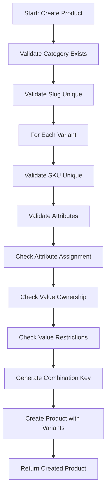

# Product API — Full Implementation Guide for Admin Panel

> **Audience:** Backend & Frontend developers implementing the admin panel for product management.  
> **Scope:** Covers all APIs, data contracts, validation rules, business logic, and do's/don'ts for the product creation feature.

---

## Table of Contents

1. [Overview](#overview)
2. [Database Schema](#database-schema)
3. [Core Concepts](#core-concepts)
4. [API Endpoints](#api-endpoints)
5. [Request & Response Formats](#request--response-formats)
6. [Validation Rules & Business Logic](#validation-rules--business-logic)
7. [Do's and Don'ts](#dos-and-donts)
8. [Implementation Flow](#implementation-flow)
9. [Error Handling](#error-handling)
10. [Frontend Integration Notes](#frontend-integration-notes)

---

## 1. Overview

This guide provides complete implementation instructions for the **Product API** used in the admin panel. The API enables creating, updating, and managing products with their variants, images, and attribute-based configurations.

### Key Capabilities

- **Create / Read / Update / Delete** products
- **Create / Update / Delete** product variants with attribute combinations
- **Manage product images** (upload, reorder, delete)
- **Configure variant pricing** with optional discounts (PERCENTAGE or FIXED)
- **Validate attribute combinations** against category restrictions
- **Soft delete** products and variants (recoverable via database)

---

## 2. Database Schema

### Prisma Models

```prisma
model Product {
  id                 Int              @id @default(autoincrement())
  name               String
  description        String?
  isActive           Boolean          @default(true)
  categoryId         Int
  brand              String?
  createdAt          DateTime         @default(now())
  slug               String
  updatedAt          DateTime         @updatedAt
  deletedAt          DateTime?
  isDeleted          Boolean          @default(false)
  productDetailsHtml String?
  images             Image[]
  category           Category         @relation(fields: [categoryId], references: [id])
  variants           ProductVariant[]
}

model ProductVariant {
  id             Int                @id @default(autoincrement())
  sku            String             @unique
  price          Decimal            @db.Decimal(10, 2)
  stock          Int
  productId      Int
  createdAt      DateTime           @default(now())
  updatedAt      DateTime           @updatedAt
  deletedAt      DateTime?
  isActive       Boolean            @default(true)
  isDeleted      Boolean            @default(false)
  discountEnd    DateTime?
  discountStart  DateTime?
  discountType   DiscountType?
  discountValue  Decimal?           @db.Decimal(10, 2)
  combinationKey String?
  images         Image[]
  orderItems     OrderItem[]
  product        Product            @relation(fields: [productId], references: [id])
  reservations   StockReservation[]
  attributes     VariantAttribute[]
}

model VariantAttribute {
  variantId        Int
  attributeValueId Int
  attributeValue   AttributeValue @relation(fields: [attributeValueId], references: [id])
  variant          ProductVariant @relation(fields: [variantId], references: [id])

  @@id([variantId, attributeValueId])
}

model Image {
  id         Int             @id @default(autoincrement())
  url        String
  altText    String?
  position   Int
  type       ImageType
  productId  Int?
  variantId  Int?
  createdAt  DateTime        @default(now())
  categoryId Int?
  deletedAt  DateTime?
  isDeleted  Boolean         @default(false)
  publicId   String?
}

enum ImageType {
  PRODUCT
  VARIANT
  CATEGORY
}

enum DiscountType {
  PERCENTAGE
  FIXED
}
```

### Important Indexes

| Model | Index | Purpose |
|-------|-------|---------|
| `Product` | `isDeleted` | Filter non-deleted products |
| `Product` | `categoryId, isDeleted` | Filter products by category |
| `ProductVariant` | `productId, isDeleted` | Filter variants by product |
| `ProductVariant` | `sku` | Unique SKU lookup |
| `ProductVariant` | `combinationKey` | Detect duplicate variant combinations |

---

## 3. Core Concepts

### 3.1 Product-Variant Relationship

- A **Product** can have **multiple variants** (e.g., different sizes, colors)
- Each **Variant** has:
  - Unique `sku` (required for inventory tracking)
  - `price` (base price)
  - `stock` (available quantity)
  - Optional `discount` configuration
  - `attributes` linking to `AttributeValue` records

### 3.2 Attribute-Based Variants

Variants are defined by their **attribute combinations**:

```
Example: T-Shirt Product
- Variant 1: { Color: Red, Size: M } -> SKU: TS-RD-M
- Variant 2: { Color: Red, Size: L } -> SKU: TS-RD-L
- Variant 3: { Color: Blue, Size: M } -> SKU: TS-BL-M
```

### 3.3 Combination Key

The `combinationKey` is a **deterministic hash** generated from attribute IDs and values:
- Format: `"attrId:valueId|attrId:valueId"` (sorted by attributeId)
- Used to detect duplicate variant combinations
- Example: `"1:5|2:10"` represents attribute 1 with value 5, and attribute 2 with value 10

### 3.4 Discount System

Two discount types are supported:

| Type | Description | Validation |
|------|-------------|------------|
| `PERCENTAGE` | Percentage off base price (max 100%) | `discountValue` = 1-100 |
| `FIXED` | Fixed amount off base price | `discountValue` <= `price` |

**Discount Date Validation:**
- `discountStart` and `discountEnd` are optional
- If both provided: `discountEnd` must be **strictly after** `discountStart`
- Discount is active when: `now >= discountStart` AND `now <= discountEnd`

### 3.5 Soft Deletes

Both `Product` and `ProductVariant` support **soft deletes**:
- `isDeleted: true` + `deletedAt: set` marks as deleted
- Soft-deleted records are **excluded from queries** by default
- Cannot restore soft-deleted products (they are not restorable)

---

## 4. API Endpoints

### Base URL

```
POST /products
GET /products
GET /products/:id
PATCH /products/:id
DELETE /products/:id
PATCH /products/:id/toggle-active
DELETE /products/:id/variants/:variantId
PATCH /products/:id/variants/:variantId/toggle-active
DELETE /products/:id/images/:imageId
```

> **Note:** All endpoints require **Admin authentication** (JWT Bearer token) except `GET /products` and `GET /products/:id` which are public.

---

## 5. Request & Response Formats

### 5.1 Create Product

**Endpoint:** `POST /products`  
**Auth:** Admin (JWT Bearer token required)  
**Headers:**
```
Content-Type: application/json
Authorization: Bearer <admin-jwt-token>
```

**Request Body:**
```json
{
  "name": "Premium T-Shirt",
  "description": "High-quality cotton t-shirt with modern fit",
  "slug": "premium-t-shirt",
  "categoryId": 1,
  "productDetailsHtml": "<ul><li>100% Cotton</li><li>Available in multiple colors</li></ul>",
  "isActive": true,
  "images": [
    {
      "url": "https://example.com/tshirt-front.jpg",
      "publicId": "tshirt-front-123",
      "altText": "Front view of t-shirt",
      "position": 0
    },
    {
      "url": "https://example.com/tshirt-back.jpg",
      "publicId": "tshirt-back-123",
      "altText": "Back view of t-shirt",
      "position": 1
    }
  ],
  "variants": [
    {
      "sku": "TS-RED-M",
      "price": 1200,
      "stock": 50,
      "isActive": true,
      "discountType": "PERCENTAGE",
      "discountValue": 10,
      "discountStart": "2026-01-01T00:00:00.000Z",
      "discountEnd": "2026-12-31T23:59:59.000Z",
      "attributes": [
        {
          "attributeId": 1,
          "valueId": 5
        },
        {
          "attributeId": 2,
          "valueId": 10
        }
      ]
    },
    {
      "sku": "TS-BLUE-L",
      "price": 1200,
      "stock": 30,
      "isActive": true,
      "attributes": [
        {
          "attributeId": 1,
          "valueId": 6
        },
        {
          "attributeId": 2,
          "valueId": 11
        }
      ]
    }
  ]
}
```

**Field Rules:**

| Field | Type | Required | Rules |
|-------|------|----------|-------|
| `name` | string | **Yes** | Product name |
| `description` | string | **Yes** | Product description |
| `slug` | string | **Yes** | Lowercase, hyphen-separated, unique. Pattern: `^[a-z0-9]+(?:-[a-z0-9]+)*$` |
| `categoryId` | number | **Yes** | Must reference an existing, non-deleted category |
| `productDetailsHtml` | string | No | HTML content for product details section |
| `isActive` | boolean | No | Default: `true` |
| `images` | array | No | Array of image objects |
| `images[].url` | string | **Yes** (if images provided) | Image URL (can be Cloudinary URL or base64) |
| `images[].publicId` | string | No | Cloudinary public ID for deletion |
| `images[].altText` | string | No | Alt text for accessibility |
| `images[].position` | number | No | Display order, defaults to array index |
| `variants` | array | **Yes** | **At least one variant required** |
| `variants[].sku` | string | No | If omitted, auto-generated as `SKU-{timestamp}-{random}` |
| `variants[].price` | number | **Yes** | Must be positive number |
| `variants[].stock` | number | **Yes** | Must be non-negative integer |
| `variants[].isActive` | boolean | No | Default: `true` |
| `variants[].discountType` | string | No | `PERCENTAGE` or `FIXED` |
| `variants[].discountValue` | number | No | Required if `discountType` provided |
| `variants[].discountStart` | string (ISO date) | No | ISO 8601 date string |
| `variants[].discountEnd` | string (ISO date) | No | ISO 8601 date string |
| `variants[].attributes` | array | **Yes** | Array of `{ attributeId, valueId }` |
| `variants[].attributes[].attributeId` | number | **Yes** | Must be assigned to product's category |
| `variants[].attributes[].valueId` | number | **Yes** | Must belong to the specified `attributeId` |

**Response:**
```json
{
  "message": "Product created successfully",
  "status": "success",
  "data": {
    "id": 1,
    "name": "Premium T-Shirt",
    "description": "High-quality cotton t-shirt with modern fit",
    "slug": "premium-t-shirt",
    "categoryId": 1,
    "productDetailsHtml": "<ul><li>100% Cotton</li></ul>",
    "isActive": true,
    "isDeleted": false,
    "createdAt": "2026-01-27T06:00:00.000Z",
    "updatedAt": "2026-01-27T06:00:00.000Z",
    "category": {
      "id": 1,
      "name": "Clothing"
    },
    "variants": [
      {
        "id": 1,
        "sku": "TS-RED-M",
        "price": 1200,
        "stock": 50,
        "isActive": true,
        "isDeleted": false,
        "discountType": "PERCENTAGE",
        "discountValue": 10,
        "discountStart": "2026-01-01T00:00:00.000Z",
        "discountEnd": "2026-12-31T23:59:59.000Z",
        "combinationKey": "1:5|2:10",
        "attributes": [
          {
            "attributeValueId": 5,
            "attributeValue": {
              "id": 5,
              "value": "Red",
              "attribute": {
                "id": 1,
                "name": "Color"
              }
            }
          },
          {
            "attributeValueId": 10,
            "attributeValue": {
              "id": 10,
              "value": "M",
              "attribute": {
                "id": 2,
                "name": "Size"
              }
            }
          }
        ]
      }
    ],
    "images": [
      {
        "id": 1,
        "url": "https://example.com/tshirt-front.jpg",
        "altText": "Front view of t-shirt",
        "position": 0,
        "type": "PRODUCT"
      }
    ]
  }
}
```

---

### 5.2 Get All Products

**Endpoint:** `GET /products`  
**Auth:** Public

**Query Parameters:**
| Param | Type | Required | Default | Description |
|-------|------|----------|---------|-------------|
| `page` | number | No | `1` | Page number |
| `limit` | number | No | `10` | Items per page |
| `search` | string | No | - | Search by product name (case-insensitive) |
| `includeStock` | boolean | No | `true` | Include stock information |

**Response:**
```json
{
  "message": "Products found",
  "status": "success",
  "data": [
    {
      "id": 1,
      "name": "Premium T-Shirt",
      "slug": "premium-t-shirt",
      "isActive": true,
      "createdAt": "2026-01-27T06:00:00.000Z",
      "category": {
        "id": 1,
        "name": "Clothing"
      },
      "variants": [
        {
          "id": 1,
          "price": 1200,
          "stock": 50,
          "discountType": "PERCENTAGE",
          "discountValue": 10,
          "discountStart": "2026-01-01T00:00:00.000Z",
          "discountEnd": "2026-12-31T23:59:59.000Z"
        }
      ],
      "images": [
        {
          "url": "https://example.com/tshirt-front.jpg",
          "position": 0
        }
      ]
    }
  ],
  "meta": {
    "total": 100,
    "page": 1,
    "limit": 10,
    "totalPages": 10
  }
}
```

---

### 5.3 Get Single Product

**Endpoint:** `GET /products/:id`  
**Auth:** Public

**Response:**
```json
{
  "message": "Product found",
  "status": "success",
  "data": {
    "id": 1,
    "name": "Premium T-Shirt",
    "description": "High-quality cotton t-shirt",
    "slug": "premium-t-shirt",
    "categoryId": 1,
    "productDetailsHtml": "<ul><li>100% Cotton</li></ul>",
    "isActive": true,
    "isDeleted": false,
    "createdAt": "2026-01-27T06:00:00.000Z",
    "updatedAt": "2026-01-27T06:00:00.000Z",
    "category": {
      "id": 1,
      "name": "Clothing"
    },
    "variants": [
      {
        "id": 1,
        "sku": "TS-RED-M",
        "price": 1200,
        "stock": 50,
        "isActive": true,
        "isDeleted": false,
        "discountType": "PERCENTAGE",
        "discountValue": 10,
        "discountStart": "2026-01-01T00:00:00.000Z",
        "discountEnd": "2026-12-31T23:59:59.000Z",
        "combinationKey": "1:5|2:10",
        "attributes": [
          {
            "attributeValueId": 5,
            "attributeValue": {
              "id": 5,
              "value": "Red",
              "attribute": {
                "id": 1,
                "name": "Color"
              }
            }
          }
        ]
      }
    ],
    "images": [
      {
        "id": 1,
        "url": "https://example.com/tshirt-front.jpg",
        "altText": "Front view",
        "position": 0,
        "type": "PRODUCT"
      }
    ]
  }
}
```

---

### 5.4 Update Product

**Endpoint:** `PATCH /products/:id`  
**Auth:** Admin

**Request Body:**
```json
{
  "name": "Premium T-Shirt - Updated",
  "description": "Updated description",
  "productDetailsHtml": "<ul><li>100% Organic Cotton</li></ul>",
  "isActive": true,
  "categoryId": 2,
  "variants": [
    {
      "id": 1,
      "price": 1100,
      "stock": 45,
      "sku": "TS-RED-M-UPD",
      "isActive": true,
      "discountType": "PERCENTAGE",
      "discountValue": 15,
      "discountStart": "2026-02-01T00:00:00.000Z",
      "discountEnd": "2026-11-30T23:59:59.000Z",
      "attributes": [
        { "attributeId": 1, "valueId": 5 },
        { "attributeId": 2, "valueId": 10 }
      ]
    },
    {
      "price": 1100,
      "stock": 25,
      "sku": "TS-GREEN-S",
      "isActive": true,
      "attributes": [
        { "attributeId": 1, "valueId": 7 },
        { "attributeId": 2, "valueId": 9 }
      ]
    }
  ],
  "images": [
    {
      "id": 1,
      "url": "https://example.com/tshirt-front-updated.jpg",
      "altText": "Updated front view",
      "position": 0
    }
  ]
}
```

**Field Rules:**

| Field | Type | Required | Rules |
|-------|------|----------|-------|
| `name` | string | No | Product name |
| `description` | string | No | Product description |
| `productDetailsHtml` | string | No | HTML content for product details |
| `isActive` | boolean | No | Toggle product status |
| `categoryId` | number | No | Must reference existing, non-deleted category |
| `variants` | array | No | **Variants with `id` update existing, without `id` create new** |
| `variants[].id` | number | No | If provided, updates existing variant |
| `variants[].sku` | string | No | Must be unique across all variants |
| `variants[].price` | number | No (if updating) | Required for new variants |
| `variants[].stock` | number | No (if updating) | Required for new variants |
| `variants[].isActive` | boolean | No | Toggle variant status |
| `variants[].discountType` | string | No | `PERCENTAGE` or `FIXED` |
| `variants[].discountValue` | number | No | Required if `discountType` provided |
| `variants[].discountStart` | string (ISO date) | No | ISO 8601 date string |
| `variants[].discountEnd` | string (ISO date) | No | ISO 8601 date string |
| `variants[].attributes` | array | No | Array of `{ attributeId, valueId }` |
| `images` | array | No | **Replaces all existing images** |
| `images[].id` | number | No | If provided, updates existing image |
| `images[].url` | string | **Yes** | Image URL |
| `images[].altText` | string | No | Alt text |
| `images[].position` | number | No | Display order |

> **Important:** Variants **not included** in the update array will be **soft-deleted** (marked `isDeleted: true`).

---

### 5.5 Delete Product

**Endpoint:** `DELETE /products/:id`  
**Auth:** Admin

**Request Body:** None

**Response:**
```json
{
  "message": "Product deleted successfully",
  "status": "success",
  "data": null
}
```

**Rules:**
- **Soft delete only** - `isDeleted` is set to `true`, `deletedAt` is set
- Cannot delete if product has **active variants** (non-deleted)
- Already deleted products return: `"Product already deleted"`

---

### 5.6 Toggle Product Active Status

**Endpoint:** `PATCH /products/:id/toggle-active`  
**Auth:** Admin

**Request Body:** None

**Response:**
```json
{
  "message": "Product is now inactive",
  "status": "success",
  "data": {
    "id": 1,
    "name": "Premium T-Shirt",
    "isActive": false,
    "updatedAt": "2026-01-27T06:30:00.000Z"
  }
}
```

---

### 5.7 Delete Product Variant

**Endpoint:** `DELETE /products/:id/variants/:variantId`  
**Auth:** Admin

**Request Body:** None

**Response:**
```json
{
  "message": "Variant deleted successfully",
  "status": "success",
  "data": null
}
```

---

### 5.8 Toggle Variant Active Status

**Endpoint:** `PATCH /products/:id/variants/:variantId/toggle-active`  
**Auth:** Admin

**Request Body:** None

**Response:**
```json
{
  "message": "Variant is now inactive",
  "status": "success",
  "data": {
    "id": 1,
    "sku": "TS-RED-M",
    "isActive": false,
    "updatedAt": "2026-01-27T06:30:00.000Z"
  }
}
```

---

### 5.9 Delete Product Image

**Endpoint:** `DELETE /products/:id/images/:imageId`  
**Auth:** Admin

**Request Body:** None

**Response:**
```json
{
  "message": "Image deleted successfully",
  "status": "success",
  "data": null
}
```

---

## 6. Validation Rules & Business Logic

### 6.1 Product Creation Validation

| Validation | Error Message |
|------------|---------------|
| Slug must be unique (among non-deleted products) | `"Product with this slug already exists"` |
| Slug exists for inactive product | `"This slug exists for an inactive product"` |
| At least one variant required | `"Product must have at least one variant"` |
| SKU must be unique | `"SKU 'X' is already in use by another product variant"` |
| Attribute value not found or deleted | `"Attribute value X not found."` |
| Attribute value doesn't belong to attribute | `"Attribute value X does not belong to attribute Y."` |
| Duplicate attribute in variant | `"Duplicate attribute type X provided for a variant"` |
| Attribute not assigned to category | `"Attribute X is not applicable to this product's category."` |
| Value not allowed (SELECTED mode) | `"Value X is not allowed for attribute Y in this product's category."` |
| No values allowed (NONE mode) | `"No values are allowed for attribute X in this product's category."` |
| Discount end before start | `"Discount end date must be after discount start date"` |
| Fixed discount exceeds price | `"Fixed discount value cannot exceed the variant price"` |

### 6.2 Variant Attribute Validation Flow

The backend performs **4 levels of validation** for each variant's attributes:

1. **Validation A - Category Assignment Check**
   - Each `attributeId` must be assigned to the product's category
   - Checks parent categories for inherited attributes
   - Error: `"Attribute X is not applicable to this product's category."`

2. **Validation B - Value Ownership Check**
   - Each `valueId` must belong to the claimed `attributeId`
   - Error: `"Value X does not belong to attribute Y."`

3. **Validation C - Duplicate Attribute Check**
   - No duplicate `attributeId` within a single variant
   - Error: `"Duplicate attribute type X. A variant cannot have two values for the same attribute."`

4. **Validation D - Value Restriction Mode Check**
   - If `valueRestrictionMode === 'NONE'`: No values allowed
   - If `valueRestrictionMode === 'SELECTED'`: Only specified `valueIds` allowed
   - If `valueRestrictionMode === 'ALL'`: All values allowed (default)

### 6.3 Discount Calculation Logic

```typescript
// PricingService.calculateVariantPricing()
if (discountType === 'PERCENTAGE') {
  // Clamp to max 100%
  discountAmount = (basePrice * Math.min(100, discountValue)) / 100;
} else if (discountType === 'FIXED') {
  // Clamp to not exceed base price
  discountAmount = Math.min(basePrice, discountValue);
}
finalPrice = Math.max(0, basePrice - discountAmount);
```

**Discount is active when:**
- `discountType` is set
- `discountValue > 0`
- `now >= discountStart` (if provided)
- `now <= discountEnd` (if provided)

---

## 7. Do's and Don'ts

### Do's

- ✅ **Always provide at least one variant** when creating a product
- ✅ **Use unique SKUs** for each variant (or let the system auto-generate)
- ✅ **Fetch category attributes first** to know which attributes are available
- ✅ **Validate attribute combinations** before sending to API
- ✅ **Use ISO 8601 date format** for discount dates (`YYYY-MM-DDTHH:mm:ss.sssZ`)
- ✅ **Include `publicId`** when uploading images to Cloudinary (for future deletion)
- ✅ **Set `position`** for images to control display order
- ✅ **Handle soft-deleted products** in your UI (show as "archived" or "deleted")
- ✅ **Use the `includeStock` query param** to optimize performance when stock not needed

### Don'ts

- ❌ **Don't send duplicate attribute combinations** (same `attributeId:valueId` pairs)
- ❌ **Don't use special characters in slugs** (only lowercase letters, numbers, hyphens)
- ❌ **Don't set `discountValue` without `discountType`**
- ❌ **Don't set `discountEnd` before `discountStart`**
- ❌ **Don't set `discountValue` > 100 for PERCENTAGE** (will be clamped)
- ❌ **Don't set `discountValue` > `price` for FIXED** (will be clamped)
- ❌ **Don't send attributes not assigned to the category**
- ❌ **Don't send `valueId` that doesn't belong to the `attributeId`**
- ❌ **Don't send empty variants array**
- ❌ **Don't try to restore soft-deleted products** (not supported)

---

## 8. Implementation Flow

### 8.1 Creating a New Product (Step-by-Step)



### 8.2 Pre-requisites for Product Creation

Before creating a product, the admin panel should:

1. **Fetch available categories** (`GET /categories`)
2. **Fetch attributes for selected category** (`GET /categories/:slug/attributes`)
3. **Build variant form** based on available attributes
4. **Validate user input** before submission

### 8.3 API Call Sequence

```javascript
// Step 1: Get categories
const categories = await fetch('/api/categories');

// Step 2: Get attributes for selected category
const attributes = await fetch(`/api/categories/${categoryId}/attributes`);

// Step 3: Create product
const product = await fetch('/api/products', {
  method: 'POST',
  headers: {
    'Content-Type': 'application/json',
    'Authorization': `Bearer ${adminToken}`
  },
  body: JSON.stringify(productData)
});
```

---

## 9. Error Handling

### HTTP Status Codes

| Code | Description |
|------|-------------|
| `200` | Success |
| `201` | Created (for POST) |
| `400` | Bad Request (validation error) |
| `401` | Unauthorized (missing/invalid JWT) |
| `403` | Forbidden (not admin role) |
| `404` | Not Found |
| `409` | Conflict (slug/SKU already exists) |

### Common Error Responses

**Validation Error (400):**
```json
{
  "statusCode": 400,
  "message": "Product must have at least one variant",
  "error": "Bad Request"
}
```

**Conflict Error (409):**
```json
{
  "statusCode": 409,
  "message": "Product with this slug already exists",
  "error": "Conflict"
}
```

**Not Found Error (404):**
```json
{
  "statusCode": 404,
  "message": "Category not found",
  "error": "Not Found"
}
```

**Unauthorized Error (401):**
```json
{
  "statusCode": 401,
  "message": "Unauthorized",
  "error": "Unauthorized"
}
```

---

## 10. Frontend Integration Notes

### 10.1 Image Upload Flow

1. **Upload to Cloudinary** (or your file storage service)
2. **Get the URL and publicId** from the response
3. **Include in product creation** as `images` array

```javascript
// Example Cloudinary upload
const uploadImage = async (file) => {
  const formData = new FormData();
  formData.append('file', file);
  formData.append('upload_preset', 'your-preset');
  
  const response = await fetch('https://api.cloudinary.com/v1_1/your-cloud/image/upload', {
    method: 'POST',
    body: formData
  });
  
  const data = await response.json();
  return {
    url: data.secure_url,
    publicId: data.public_id
  };
};
```

### 10.2 Attribute Selection UI

```javascript
// Fetch attributes for a category
const fetchCategoryAttributes = async (categoryId) => {
  const response = await fetch(`/api/categories/${categoryId}/attributes`);
  const { data } = await response.json();
  
  // data structure:
  // [
  //   {
  //     attributeId: 1,
  //     attribute: { id: 1, name: "Color", values: [...] },
  //     valueRestrictionMode: "ALL" | "SELECTED" | "NONE",
  //     valueIds: [5, 6, 7] // only for SELECTED mode
  //   }
  // ]
  
  return data;
};
```

### 10.3 Variant Builder Component

```javascript
// Build variants from selected attribute values
const buildVariants = (selectedAttributes) => {
  // selectedAttributes: { attributeId: valueId, ... }
  const attributes = Object.entries(selectedAttributes).map(([attrId, valueId]) => ({
    attributeId: parseInt(attrId),
    valueId: parseInt(valueId)
  }));
  
  return {
    sku: generateSKU(attributes),
    price: 0,
    stock: 0,
    attributes
  };
};

// Generate combination key
const generateCombinationKey = (attributes) => {
  return attributes
    .sort((a, b) => a.attributeId - b.attributeId)
    .map(a => `${a.attributeId}:${a.valueId}`)
    .join('|');
};
```

### 10.4 Authentication Headers

```javascript
// All admin requests must include:
const headers = {
  'Content-Type': 'application/json',
  'Authorization': `Bearer ${localStorage.getItem('adminToken')}`
};
```

### 10.5 Date Format for Discounts

```javascript
// Convert to ISO 8601 format
const formatDateForAPI = (date) => {
  return new Date(date).toISOString();
};

// Example:
const discountStart = formatDateForAPI('2026-01-01');
// Output: "2026-01-01T00:00:00.000Z"
```

---

## Appendix A: Related API Endpoints

### Category-Attribute Integration

To properly create products, you need to understand the category-attribute system:

| Endpoint | Purpose |
|----------|---------|
| `GET /categories/:slug/attributes` | Get all attributes available for a category (including inherited) |
| `GET /attributes` | List all attributes |
| `GET /attribute-values/attribute/:attributeId` | Get all values for a specific attribute |

### Response from Category Attributes

```json
{
  "message": "Category attributes retrieved successfully",
  "status": "success",
  "data": [
    {
      "categoryId": 1,
      "attributeId": 1,
      "sortOrder": 0,
      "isRequired": false,
      "isVariantSelectable": true,
      "valueRestrictionMode": "ALL",
      "attribute": {
        "id": 1,
        "name": "Color",
        "values": [
          { "id": 5, "value": "Red" },
          { "id": 6, "value": "Blue" },
          { "id": 7, "value": "Green" }
        ]
      },
      "valueIds": []
    },
    {
      "categoryId": 1,
      "attributeId": 2,
