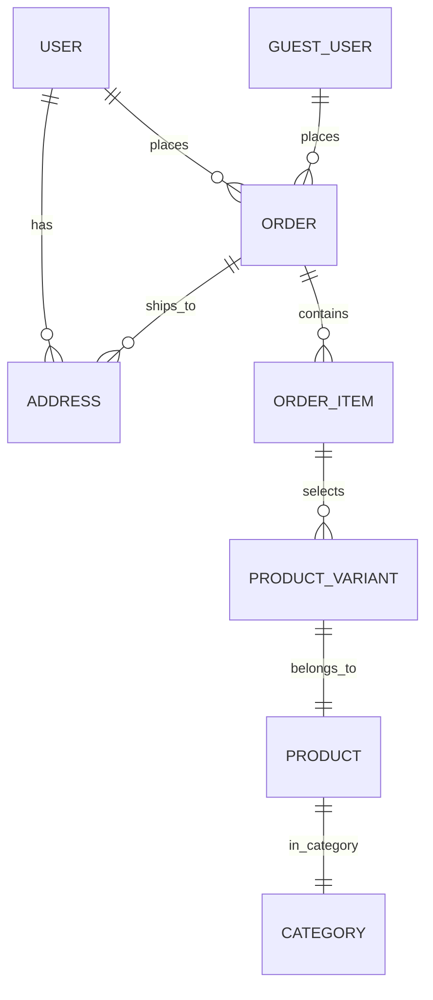

# Guest Checkout Implementation Plan

## Executive Summary

This document outlines the architecture for implementing guest checkout functionality in the existing e-commerce system. The goal is to allow customers to place orders without logging in, using reCAPTCHA verification instead of authentication, while maintaining the existing order and product infrastructure.

---

## 1. Database Schema Changes

### 1.1 New GuestUser Model

Add a new table to store guest user information:

```prisma
model GuestUser {
  id        Int      @id @default(autoincrement())
  name      String
  phone     String   @unique  // Required - used for order tracking
  email     String?           // Optional - for order notifications
  address   String
  city      String?
  postalCode String?
  country   String   @default("Bangladesh")
  
  createdAt DateTime @default(now())
  updatedAt DateTime @updatedAt
  
  orders    Order[]
}
```

### 1.2 Modified Order Model

Add optional `guestUserId` field while keeping existing `userId`:

```prisma
model Order {
  id            Int    @id @default(autoincrement())
  orderNumber   String?
  invoiceNumber String?
  
  // === EXISTING: For authenticated users ===
  userId        Int
  user          User   @relation(fields: [userId], references: [id])
  
  // === NEW: For guest users ===
  guestUserId   Int?
  guestUser     GuestUser? @relation(fields: [guestUserId], references: [id])
  
  // === Rest remains the same ===
  addressId     Int?
  address       Address? @relation(fields: [addressId], references: [id])
  status        OrderStatus    @default(PENDING)
  paymentMethod PaymentMethod @default(CASH_ON_DELIVERY)
  total         Decimal        @db.Decimal(10, 2)
  deliveryType DeliveryType   @default(INSIDE_DHAKA)
  deliveryCharge Decimal      @default(70) @db.Decimal(10, 2)
  
  items       OrderItem[]
  reservations StockReservation[]
  
  createdAt   DateTime @default(now())
  updatedAt   DateTime @updatedAt
  
  // === INDEXES ===
  @@index([guestUserId])
}
```

**Note:** The `userId` remains required (NOT NULL). For guest orders, we create a special "guest" user record in the `User` table OR use a nullable approach with validation in the application layer.

### 1.3 Alternative: Nullable userId Approach (Recommended)

To make the schema cleaner, make `userId` nullable:

```prisma
model Order {
  id            Int    @id @default(autoincrement())
  orderNumber   String?
  invoiceNumber String?
  
  // === Either user OR guestUser (but at least one required) ===
  userId        Int?
  user          User?  @relation(fields: [userId], references: [id])
  
  guestUserId   Int?
  guestUser     GuestUser? @relation(fields: [guestUserId], references: [id])
  
  // Rest unchanged...
```
**Validation:** Add application-level check to ensure exactly one of `userId` or `guestUserId` is provided.

---

## 2. API Endpoint Structure

### 2.1 New Guest Checkout Endpoints

```
POST /orders/guest          - Create order as guest (no auth required)
GET  /orders/guest/:phone  - Track guest order by phone number
GET  /orders/guest/:id     - Get guest order details (with phone verification)
```

### 2.2 Endpoint: Create Guest Order

**Route:** `POST /orders/guest`

**No JWT Required** - Uses reCAPTCHA instead.

**Request Body:**
```typescript
{
  // Guest contact information
  name: "John Doe",
  phone: "8801XXXXXXXXX",      // Required - unique identifier
  email: "john@example.com",    // Optional
  address: "123 Main Street",
  city: "Dhaka",
  postalCode: "1200",
  country: "Bangladesh",
  
  // reCAPTCHA verification
  recaptchaToken: "XYZ...",     // From Google reCAPTCHA
  
  // Order details (same as authenticated)
  items: [
    { variantId: 1, quantity: 2 },
    { variantId: 5, quantity: 1 }
  ],
  paymentMethod: "CASH_ON_DELIVERY",
  deliveryType: "INSIDE_DHAKA"
}
```

**Response:**
```typescript
{
  "message": "Order placed successfully",
  "status": "success",
  "data": {
    "orderId": 123,
    "orderNumber": "202604111234",
    "invoiceNumber": "INV-1234070426",
    "total": 450.00,
    "status": "PENDING",
    "estimatedDelivery": "2024-04-14"
  }
}
```

### 2.3 Guest Order Tracking

**Route:** `GET /orders/guest/track?phone=8801XXXXXXXXX`

Allows guests to track their order without login.

---

## 3. Data Flow Diagram

```mermaid
sequenceDiagram
    participant C as Customer (Frontend)
    participant A as API Gateway
    participant R as reCAPTCHA Service
    participant DB as Database
    
    Note over C,A: Guest Checkout Flow
    
    C->>A: Submit order with guest details + recaptchaToken
    
    A->>R: Verify recaptchaToken (POST to Google)
    
    alt reCAPTCHA Invalid
        R-->>A: score < 0.5 or error
        A-->>C: 400 Bad Request (Bot detected)
    end
    
    reCAPTCHA Valid
        R-->>A: score >= 0.5
        A->>DB: Create/Update GuestUser record
        A->>DB: Create Order with guestUserId
        
        Note over A,DB: Same transaction for order items & stock
        
        DB-->>A: Order created successfully
        A-->>C: 201 Created (Order confirmation)
    end
```

---

## 4. reCAPTCHA Implementation Details

### 4.1 Flow Overview

```
┌─────────────────────────────────────────────────────────┐
│                    FRONTEND (React/Vue)                  │
├─────────────────────────────────────────────────────────┤
│  1. Load Google reCAPTCHA script on checkout page      │
│  2. Execute: grecaptcha.execute(siteKey, {action})    │
│  3. Get token → include in POST request body          │
└─────────────────────────────────────────────────────────┘
                          │
                          ▼
┌─────────────────────────────────────────────────────────┐
│                  BACKEND (NestJS)                       │
├─────────────────────────────────────────────────────────┤
│  1. Extract recaptchaToken from request body            │
│  2. POST to Google API:                               │
│     https://www.google.com/recaptcha/api/siteverify   │
│     secret=RECAPTCHA_SECRET                          │
│     response=token                                   │
│     remoteip=client_ip                               │
│                                                         │
│  3. Verify response:                                 │
│     - success: true                                 │
│     - score: 0.0-1.0 (v3)                          │
│     - action: "checkout"                             │
│                                                         │
│  4. If score >= 0.5 → proceed with order            │
│     If score < 0.5 → reject as likely bot            │
└─────────────────────────────────────────────────────────┘
```

### 4.2 Configuration

Add to `.env`:
```
RECAPTCHA_SECRET_KEY=your_secret_key_here
RECAPTCHA_SITE_KEY=your_site_key_here
RECAPTCHA_MIN_SCORE=0.5
```

### 4.3 Security Considerations

1. **Token Expiry:** reCAPTCHA tokens expire after 2 minutes
2. **One-time Use:** Each token can only be used once
3. **Score Threshold:** Use 0.5 as minimum (adjust based on testing)
4. **Action Validation:** Verify the action matches "checkout"

---

## 5. Order Processing Logic

### 5.1 Guest Order Creation

```typescript
async createGuestOrder(dto: CreateGuestOrderDto) {
  // 1. Verify reCAPTCHA
  const recaptchaResult = await this.verifyRecaptcha(dto.recaptchaToken);
  
  if (!recaptchaResult.success || recaptchaResult.score < 0.5) {
    throw new ForbiddenException('Bot detection: Please try again');
  }
  
  // 2. Find or create GuestUser (by phone as unique identifier)
  //    Note: reCAPTCHA is verified but not stored in the database
  const guestUser = await this.findOrCreateGuestUser({
    name: dto.name,
    phone: dto.phone,
    email: dto.email,
    address: dto.address,
    city: dto.city
  });
  
  // 3. Create order with guestUserId (same logic as authenticated)
  const order = await this.prisma.$transaction(async (tx) => {
    // Validate variants
    // Check stock
    // Create order with guestUserId
    // Create order items
    return order;
  });
  
  return order;
}
```

### 5.2 Logic Separation

| Function | Authenticated Order | Guest Order |
|----------|-------------------|-------------|
| User ID source | JWT token → `req.user.id` | None |
| User record | `User` table | `GuestUser` table |
| Recaptcha | Not required | **Required** |
| Address | Can use saved addresses | Must provide new address |
| Order history | In profile | Via phone number |

---

## 6. Minimal Changes Summary

### 6.1 Files to Modify

| File | Change Type | Description |
|------|------------|-------------|
| `prisma/schema.prisma` | **Modify** | Add GuestUser model, guestUserId to Order |
| `src/auth/` | Modify | Add reCAPTCHA guard/service |
| `src/order/dto/` | **Add** | CreateGuestOrderDto |
| `src/order/` | **Add** | Guest order endpoints in controller and service |

### 6.2 Files to Create

| File | Purpose |
|------|---------|
| `src/auth/recaptcha.service.ts` | Verify reCAPTCHA tokens |
| `src/auth/recaptcha.guard.ts` | Optional guard for guest endpoints |

### 6.3 Migration Steps

1. **Step 1:** Add GuestUser table to schema
2. **Step 2:** Add guestUserId to Order (make nullable)
3. **Step 3:** Run `npx prisma migrate add guest_checkout`
4. **Step 4:** Implement reCAPTCHA service
5. **Step 5:** Add guest order endpoints
6. **Step 6:** Test flow

---

## 7. Key Design Decisions

### 7.1 Why Separate GuestUser Table?

1. **Data Isolation:** Guest data is temporary/different from registered users
2. **No Password:** Guests don't have authentication credentials
3. **Phone as Identifier:** Uses phone number instead of email as primary identifier

### 7.2 Why Same Order Table?

1. **Shared Infrastructure:** Uses same product catalog, pricing, inventory
2. **Unified Admin:** Single dashboard for all orders
3. **Reporting:** Simpler sales reports
4. **Minimal Changes:** Doesn't require duplicating order logic

### 7.3 Why reCAPTCHA (not stored)?

1. **Verification Only:** reCAPTCHA token is used to verify the user is human
2. **No Storage Needed:** Token verification happens in real-time, no need to store
3. **Invisible:** Uses reCAPTCHA v3 for better UX (no checkbox)
4. **Sufficient:** Basic bot protection is enough for guest checkout

---

## 8. Data Model Relationship Diagram



---

## 9. Summary

The recommended implementation:

1. **Schema:** Add `GuestUser` table, make `userId` nullable, add `guestUserId` to `Order`
2. **API:** New `POST /orders/guest` endpoint without JWT but with reCAPTCHA
3. **Data Flow:** Same order processing, just with guest-specific user lookup
4. **Shared Tables:** Uses existing `Order`, `Product`, `OrderItem` tables
5. **Minimal Impact:** Existing authenticated flow unchanged

This approach achieves your requirements:
- ✅ Guests can order without login
- ✅ reCAPTCHA prevents bots
- ✅ Guest data separate from registered users
- ✅ Reuses same Order and Product tables
- ✅ Minimal changes to existing system
- ✅ Dynamic and extensible