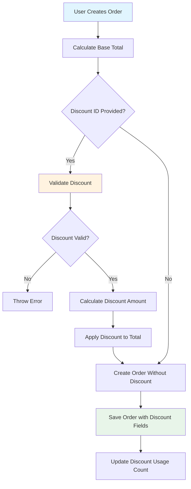

# Discount System Implementation Plan

## Executive Summary

This document outlines a non-breaking, production-ready approach to introduce a flat discount system (percentage or fixed amount) to your existing e-commerce backend. The system is designed to integrate seamlessly without affecting existing orders, products, or pricing structures.

## Current System Analysis

### Existing Entities (from prisma/schema.prisma)

```
User
  ├── id, email, password, role
  └── orders[]

Product
  ├── id, name, slug, description, brand
  ├── isActive, isDeleted, deletedAt
  ├── categoryId
  └── variants[]

Order
  ├── id, userId, addressId, status
  ├── paymentMethod, total
  ├── deliveryType, deliveryCharge
  └── items[], reservations[]

OrderItem
  ├── id, orderId, variantId
  ├── quantity, price, reservationId
```

### Key Services

1. **OrderService** (src/order/order.service.ts)
   - Creates orders with items
   - Calculates: total = sum(variant.price × quantity) + deliveryCharge
   - Uses Prisma transactions for data consistency

2. **ProductService** (src/product/product.service.ts)
   - Manages products and variants
   - Each variant has its own price

---

## Approach: Non-Breaking Discount System

### Design Principle

The discount system is designed as an **optional add-on layer** that:
- Does NOT modify existing product/variant prices
- Does NOT affect historical orders
- Is fully optional in order creation
- Uses database-level constraints only where needed

---

## Step-by-Step Implementation Plan

### Phase 1: Database Schema Design

Create new Prisma models (additions only, no modifications to existing):

```prisma
// Discount types enum
enum DiscountType {
  PERCENTAGE  // e.g., 10% off
  FIXED      // e.g., 500 BDT off
}

enum DiscountTarget {
  ALL_PRODUCTS        // Discount applies to entire order
  SPECIFIC_VARIANTS   // Only selected variants
  SPECIFIC_CATEGORY // Entire category
}

enum DiscountStatus {
  ACTIVE
  EXPIRED
  SCHEDULED
  DISABLED
}

// Main discount model
model Discount {
  id          Int            @id @default(autoincrement())
  name       String         // e.g., "Summer Sale 2026"
  code       String?        @unique // Optional code (nullable for flat discounts)
  type       DiscountType
  value      Decimal        @db.Decimal(10, 2) // e.g., 10 or 500
  
  target     DiscountTarget @default(ALL_PRODUCTS)
  minOrderAmount Decimal?  @db.Decimal(10, 2) // Minimum order to qualify
  maxDiscountAmt Decimal?  @db.Decimal(10, 2) // Cap for percentage discounts
  
  isActive    Boolean       @default(true)
  startsAt    DateTime
  expiresAt   DateTime?
  
  createdAt   DateTime      @default(now())
  updatedAt   DateTime      @updatedAt
  
  // Optional: Link to specific variants/categories
  variants   ProductVariant[]
  category   Category?
  
  // Usage tracking
  usageCount Int           @default(0)
  maxUsage   Int?          // Optional limit
}
```

**Why this is non-breaking:**
- New table added, existing tables untouched
- All fields optional (no migration needed for existing data)
- Can be applied at order level without affecting products

---

### Phase 2: Order Model Enhancement

Add optional discount fields to Order (non-breaking):

```prisma
model Order {
  // ... existing fields ...
  
  // NEW FIELDS (all optional)
  discountId    Int?
  discount     Discount? @relation(fields: [discountId], references: [id])
  
  discountType  DiscountType?  // Store the type at time of purchase
  discountVal Decimal?       @db.Decimal(10, 2) // Store the value applied
  discountAmt Decimal?      @db.Decimal(10, 2) // Actual discount amount
  originalTotal Decimal?   @db.Decimal(10, 2) // Total before discount
}
```

**Risk Mitigation:**
- All new fields nullable → existing orders remain valid
- Store discount details at order creation → historical accuracy preserved

---

### Phase 3: Create Discount Module

Structure: Similar to existing modules (auth, category, product)

```
src/discount/
├── discount.module.ts
├── discount.controller.ts     // Admin: CRUD for discounts
├── discount.service.ts       // Business logic
├── dto/
│   ├── create-discount.dto.ts
│   ├── update-discount.dto.ts
│   └── apply-discount.dto.ts
```

**API Endpoints:**

| Method | Endpoint | Role | Description |
|--------|----------|------|-------------|
| POST | /discounts | ADMIN | Create new discount |
| GET | /discounts | ADMIN | List all discounts |
| GET | /discounts/:id | ADMIN | Get discount by ID |
| PATCH | /discounts/:id | ADMIN | Update discount |
| DELETE | /discounts/:id | ADMIN | Delete discount |
| POST | /discounts/validate | CUSTOMER | Validate discount applicability |
| GET | /discounts/active | PUBLIC | Get active discounts |

---

### Phase 4: Modify Order Creation Flow

Update OrderService.create() to support discounts:

```typescript
// Step 1: Calculate base total (existing)
let total = items.reduce((sum, item) => sum + item.price * item.quantity, 0);
total += deliveryCharge;

// Step 2: If discount provided, apply it
let discountAmt = 0;
let discountDetails = null;

if (dto.discountId) {
  discountDetails = await discountService.validateAndCalculate(
    discountId, 
    items, 
    total
  );
  discountAmt = discountDetails.appliedAmount;
  total -= discountAmt;
}

// Step 3: Create order with discount fields
const order = await prisma.order.create({
  data: {
    // ... existing fields
    discountId: discountDetails?.discountId,
    discountType: discountDetails?.type,
    discountVal: discountDetails?.value,
    discountAmt: discountAmt,
    originalTotal: baseTotal,
  }
});
```

---

### Phase 5: Update Create Order DTO

Add optional discount field to existing DTO:

```typescript
// src/order/dto/create-order.dto.ts

// Add to CreateOrderDto
export class CreateOrderDto {
  // ... existing fields ...
  
  @IsOptional()
  @IsInt()
  discountId?: number;
}
```

---

### Phase 6: Discount Calculation Logic

```typescript
// Inside DiscountService

async validateAndCalculate(
  discountId: number,
  orderItems: OrderItemData[],
  orderTotal: number
): Promise<DiscountCalculation> {
  // 1. Fetch discount
  const discount = await this.getById(discountId);
  
  // 2. Validate status
  if (!discount.isActive) {
    throw new BadRequestException('Discount is not active');
  }
  
  // 3. Validate date range
  const now = new Date();
  if (discount.startsAt > now) {
    throw new BadRequestException('Discount has not started yet');
  }
  if (discount.expiresAt && discount.expiresAt < now) {
    throw new BadRequestException('Discount has expired');
  }
  
  // 4. Validate minimum order amount
  if (discount.minOrderAmount && orderTotal < Number(discount.minOrderAmount)) {
    throw new BadRequestException(
      `Minimum order amount of ${discount.minOrderAmount} required`
    );
  }
  
  // 5. Calculate discount
  let appliedAmount = 0;
  
  if (discount.type === 'PERCENTAGE') {
    // Percentage: value = 10 means 10%
    appliedAmount = (orderTotal * Number(discount.value)) / 100;
    
    // Apply cap if set
    if (discount.maxDiscountAmt) {
      appliedAmount = Math.min(appliedAmount, Number(discount.maxDiscountAmt));
    }
  } else {
    // Fixed: value = 500 means 500 BDT off
    appliedAmount = Number(discount.value);
  }
  
  // 6. Don't allow discount > order total
  appliedAmount = Math.min(appliedAmount, orderTotal);
  
  return {
    discountId: discount.id,
    type: discount.type,
    value: discount.value,
    appliedAmount,
  };
}
```

---

## Execution Order

```
Step 1: Add Discount enum and models to prisma/schema.prisma
Step 2: Add optional fields to Order model
Step 3: Run: npx prisma migrate add discounts
Step 4: Create src/discount/ module files
Step 5: Implement DiscountService with validation
Step 6: Implement DiscountController (admin CRUD)
Step 7: Update CreateOrderDto (add discountId)
Step 8: Update OrderService.create() (apply discount)
Step 9: Test with sample discount
Step 10: Update API documentation
```

---

## Mermaid: Data Flow Diagram



---

## Why This Approach Is Unbreakable

| Aspect | How It's Protected |
|--------|------------------|
| **Existing Data** | New tables/fields are nullable, no migration errors |
| **Product Prices** | Not modified - prices stay in ProductVariant |
| **Existing Orders** | Null discount fields → valid historical records |
| **Transaction Safety** | Discount calculation in same transaction as order |
| **Validation** | Validates before applying, throws clear errors |
| **Audit Trail** | Stores discount details at order creation |

---

## Summary

This plan introduces a **flat discount system** that is:

1. **Non-breaking**: All existing data remains valid
2. **Flexible**: Supports percentage (%) or fixed amount (BDT) discounts
3. **Production-ready**: Includes validation, usage limits, date scheduling
4. **Auditable**: Stores discount details with each order
5. **Simple**: No complex coupon codes needed

The implementation requires changes to:
- Database schema (new models + optional Order fields)
- New Discount module (controller, service)
- OrderService integration
- Order DTO update

All changes are additive and backwards-compatible.